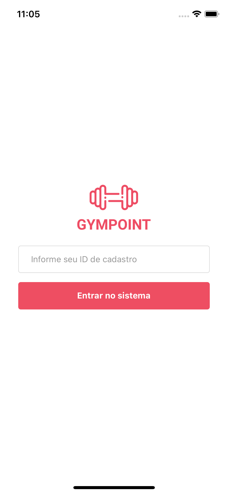
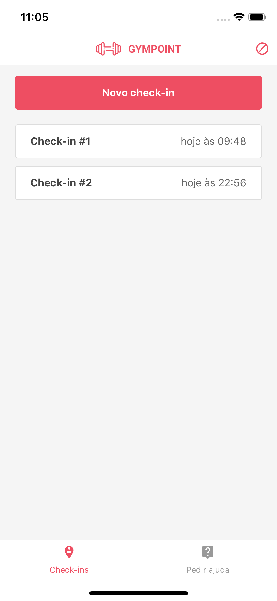
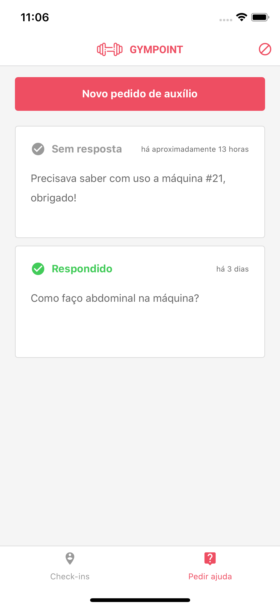

# gympoint-mobile
> Gym management application (registrations/check-ins)

[](https://appcenter.ms)

<p style="text-align: center;">
  
  
  
</p>

## Observações
Essa aplicação foi testada em dispositivos iOS e Android.

## Desenvolvimento
1. Caso esteja testando no Android, não esqueça de alterar o `baseURL` na [service do axios](https://github.com/santospatrick/gympoint-mobile/blob/master/src/services/api.js) para o seguinte formato:
```
...
baseURL: 'http://SEU_IP:PORTA',
...
```

1. [Instale as dependências](https://facebook.github.io/react-native/docs/getting-started) necessárias para seu sistema operacional

2. Instale a CLI do React Native e inicie o servidor local
```bash
yarn global add react-native-cli

# iOS
react-native run-ios --simulator "iPhone X"

# Android
react-native run-android
```
